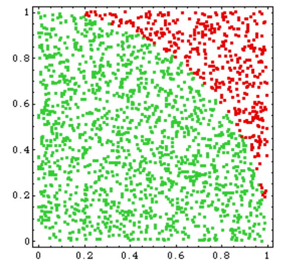

# FPGA Processor

University project to create a FPGA processor in VHDL, the goal was to compute PI's decimals

To do this, we draw random points in a square and see how many are in a quarter of a circle to get a ratio:

You can see the [schematic here](img/schematic.pdf)
